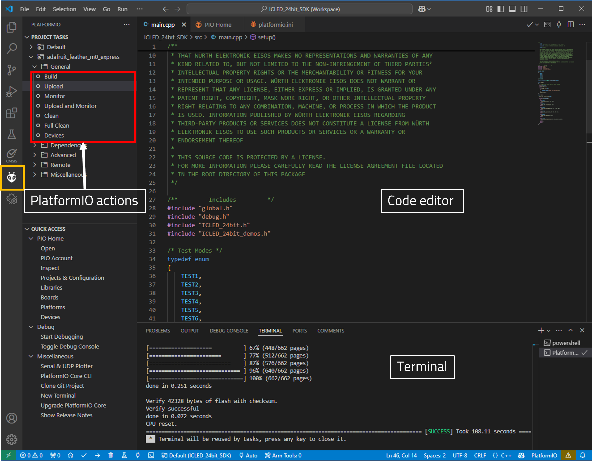

# ICLED

## Introduction

The **ICLED SDK** was designed with rapid prototyping in mind. Being fully compatible with the Adafruit ecosystem, this library allows the Feather M0 and ICLED to be easily integrated into any project.

Here are the salient features of the WE ICLED SDK. 
* The SDK is **open-source** and well documented.
* It uses popular open-source tool chain including an IDE.
* The examples are written in Arduino styled C/C++ for easy understanding.
* The core components of the SDK are written in pure C to enable easy porting to any microcontroller platform.
* Modular structure of the software stack makes it easy to integrate into any project.

### Software components

* **Install IDE**: Use your favourite development IDE (we recommend [Visual Studio Code](https://code.visualstudio.com/) with [PlatformIO](https://platformio.org/) extension).
* **PlatformIO**: This is a cross-platform, cross-architecture, multiple framework professional tool for embedded software development. It provides the tool chain necessary for software development including building, debugging, code-upload and many more. PlatformIO works well on all modern operating systems and supports a host of development boards including the Feathers from Adafruit. Further details about PlatformIO can be found under [platformio.org](https://platformio.org/).
* **ICLED SDK**: The SDK currently implements several quick start examples for the Single Wire 24-bit ICLEDs.

### Installing the tools

* Install Visual Studio Code on the platform of your choice following the [instructions](https://code.visualstudio.com/docs).
* Follow the instructions under [platformio.org](https://platformio.org/install/ide?install=vscode) to install the IDE extension.

### Quick start example

The quick start example for the ICLED_24bit_SDK demonstrates how to configure the ICLED to display different animations. 

1. In the quick start application, the ICLED is configured to show different test based examples. Changing the TEST Mode and re-uploading the code will change the animation on the ICLED board.
   
2. Inside **ICLED_24bit.h**: Define the number of ICLEDs used in the circuit

```C
// Define the size of the LED Array that is being used
#define ICLED_NUM 105
```

3. Inside the **main.cpp** file: Define the test mode to be shown. 

```C
static volatile TestMode current_mode = TEST5; // To select the quick example to be shown
```

4. Setup - The ICLED is initialized after setting up the SPI interface. After a succesfull initialization, the ICLED strip is cleared to avoid any color mismatch. 

```C
void setup() 
{
  // Using the USB serial port for debug messages
  #ifdef WE_DEBUG
    WE_Debug_Init();
  #endif
  
   if (!ICLED_Init(RGB))
    {
        WE_DEBUG_PRINT("ICLED init failed \r\n");
    }
    ICLED_clear();
}
```

5. In the **main.cpp** file, the following test examples are available:
   
```C
void loop() {

  ICLED_set_color_system(RGB);

  switch (current_mode)
    {
    case TEST1:
      ICLED_demo_Blink(0, 64, 500); 
    break;

    case TEST2: 
      ICLED_demo_Breathing(50, 25);
    break; 

    case TEST3:
      ICLED_demo_ColorWhipe(255, 0 , 0, 20, 80);
    break;

    case TEST4: 
      ICLED_demo_Cyclon(255, 0, 255, 20, 25);
    break; 

    case TEST5: 
      ICLED_demo_Rainbow(20, 10);
    break;

    case TEST6: 
      ICLED_demo_TheaterChase(255, 255, 255, 10, 100);
    break;

    default: 
    break;  
  }
}
```
### Running the example

1. Clone or download the code.
2. Open the workspace of interest with the filename `<ICLED_24bit_SDK>.code-workspace` in Visual Studio code.
3. **Build** and **Upload** the code from the PlatformIO tab as shown in the Figure below.
4. After successful upload, click on **Monitor** in the PlatformIO extension tab to view the debug logs in the serial terminal.



