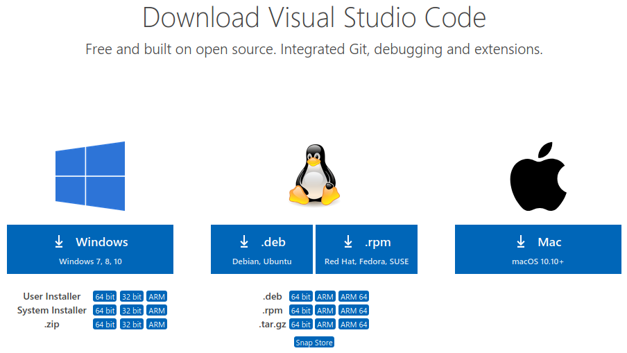
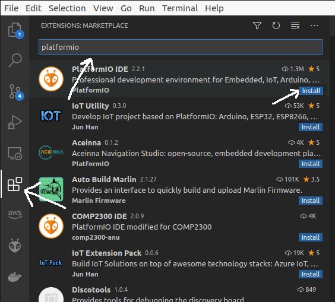
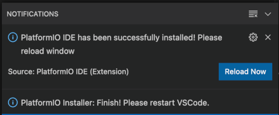
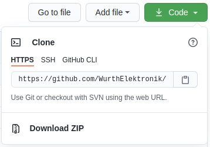
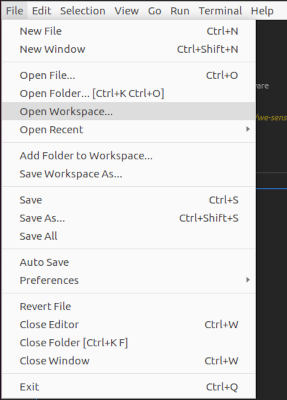
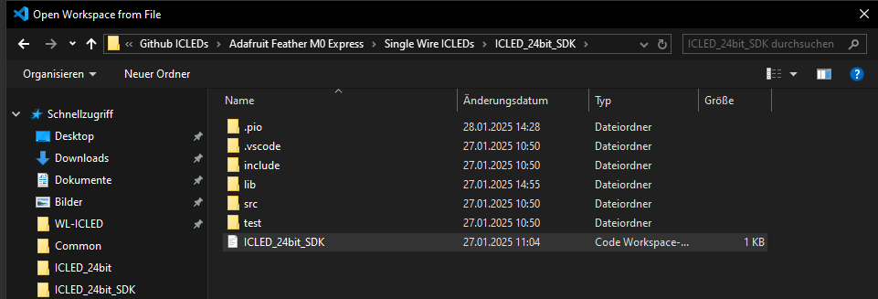
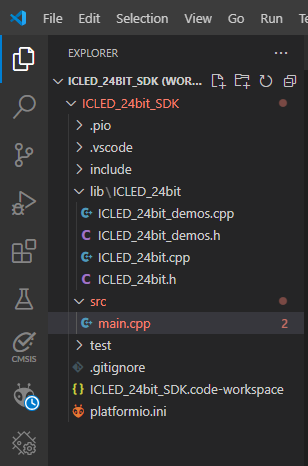
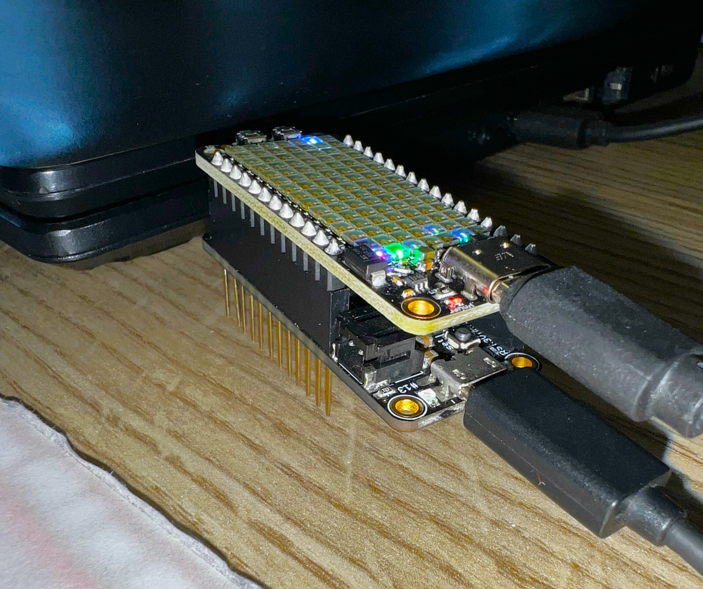
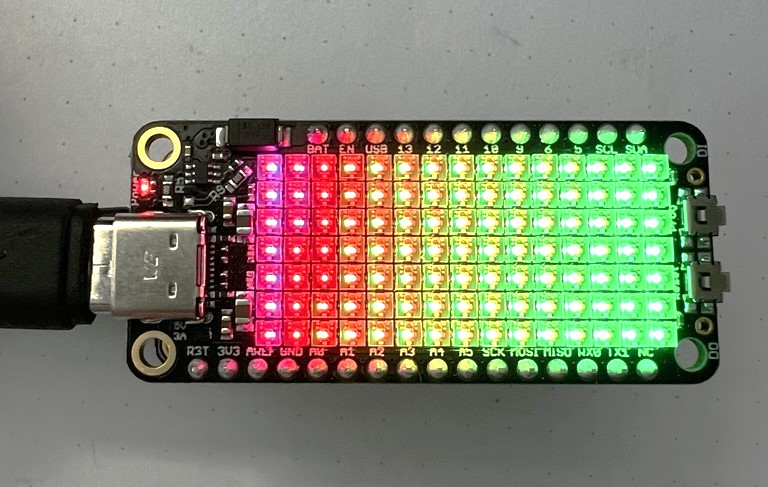

# WE ICLED SDK

[Würth Elektronik](https://www.we-online.com/en/components/products/WL-ICLED) offers a range of ICLEDs that can be controlled via the SPI interface of the a microcontroller. To facilitate quick prototyping and evaluation of these ICLEDs, Würth Elektronik provides the ICLED_24bit_SDK libraries for the **Feather M0 Express** microcontroller from [Adafruit](https://www.adafruit.com/).

[Adafruit Feather](https://www.adafruit.com/feather) is a complete line of development boards from [Adafruit](https://www.adafruit.com/) and other developers that are both standalone and stackable. They're able to be powered by [LiPo batteries](https://en.wikipedia.org/wiki/Lithium_polymer_battery) for on-the-go use or by their [micro-USB](https://www.we-online.de/katalog/de/em/connectors/input_output_connectors/wr-com) or their [UBS-C](https://www.we-online.com/de/components/products/WR-COM_USB_20_TYPE_C_RECEPTACLE_HORIZONTAL_SMT) plugs for stationary projects. Feathers are flexible, portable, and as light as their namesake. At its core, the Adafruit Feather is a complete ecosystem of products - and the best way to get your project flying.

# Repository Structure

| Microcontroller | Subfolder | Description | 
|  ---  |  ---  |  ---  |
| Feather M0 Express |  ICLED_24bit_SDK |  Contains the library to control the Single Wire 24-bit ICLEDs using the SPI interface of the M0 Microcontroller. There are also some example codes in the subfolder examples to showcase both basic and advanced usages of the IC LEDs such as color setting, animations, and effects.|

### List of Examples
| Example Name  |  Description  |
|  ---  |  ---  |
| ICLED_demo_Blink | Creates a blinking effect on the selected ICLED number acording to predefined color and brightness level set by the user. |
| ICLED_demo_Breathing	|  Creates a smooth "breathing" light effect on the ICLED strip by gradually increasing and decreasing brightness. |
| ICLED_demo_ColorWhipe	| Sequentially lights up the ICLEDs in the given color and brightness from start to end and then clears the ICLED strip. |
| ICLED_demo_Cyclon	| Sequentially lights up the ICLEDs one at a time from left to right and then back from right to left in the given color and brightness. |
| ICLED_demo_Rainbow	| Creates a dynamic "rainbow effect" on an ICLED strip by cycling through colors smoothly across all pixels. |
| ICLED_demo_TheaterChase	| Sequentially lights up every third ICLED in a repeating pattern, creating a "theater chase" effect. | 

### Supported Part Numbers
The  ICLED_24bit_SDK supports the following IC LED part numbers:

| Order Code	| Chip layout | Communication Protocol | 
| --- | --- | --- |
| 1315050930002	| Green, Red, Blue | Single Wire (24-bit)	|
| 1313210530000	| Green, Red, Blue | Single Wire (24-bit)	|
| 1312020030000	| Green, Red, Blue | Single Wire (24-bit)	|

The example projects contained in this repository have been created using the  **[Visual Studio Code](https://code.visualstudio.com/download)** using the PlatformIO extension, but other toolchains can be used if desired. The following steps will guide you through the installation process and help avoid the most common mistakes.

## Quick start guide

**Read this documentation!**

### Hardware requirements

1. Adafruit Feather M0. The current repository contains software developed on the [Adafruit Feather M0 express](https://www.adafruit.com/product/3403).

2. ICLED Board - Select the [ICLED FeatherWing](https://www.we-online.com/en/components/products/OPTO_ICLED_FEATHERWING_2#150015) or any development board with [Würth Elektronik ICLEDs](https://www.we-online.com/en/components/products/WL-ICLED) and stack it on to the Feather. Alternatively connect the Pin 6 of the M0 to the DIN pin of the first ICLED on the development board.

3. Stable power supply - Please ensure that the boards are powered using a clean and stable power supply. The following input options are available,
- **USB** interface on the M0 Feather.
>**Note**: The USB interface will also be used to upload the example code to the microcontroller.

- **LiPo** - For low power applications, it is also possible to connect a LiPo battery. Please ensure that the battery can deliver sufficient current at the desired voltage for the combination of boards used.

- [**IC LED FeatherWing** (1500015)](/ICLEDFeatherWing) via the included USB-C interface - By soldering a 0 &Omega; resistor on R8 it is possible to connect VDD nodes of the IC LED FeatherWing and the Feather M0 board.

4. Computing device with sufficient memory and an internet connection.
   
>**Note**: The software tools used in the quick start example require up to 2 GB of data storage.

### Software installation
In order to enable ease of prototyping, we use the popular cross platform integrated development environment, [Visual Studio Code](https://code.visualstudio.com/) along with some extensions. The following steps will guide you through the installation process.

1. Download and install **[Visual Studio Code](https://code.visualstudio.com/download)** by following the steps described [here](https://code.visualstudio.com/docs/setup).
>**Note**: If you are in a corporate environment, check with your IT department if you are required to enter proxy settings and credentials inside Visual Studio Code.

2. **Install** the [PlatformIO](https://platformio.org/install/ide?install=vscode) extension for Visual Studio Code.
  - Select **Extensions** in the lower left
  - **Type** platformio in the *Search window* and
  - when PlatformIO IDE extension appears, **press the blue Install button**

> **Note**: Do not close the Visual Studio Code window until PlatformIO is completely installed.
> Installation process can be slow, depending on speed and network connection of your computer. 

3. After the PlatformIO extension has been installed follow the on screen instructions to **restart** Visual Studio Code.

The PlatformIO extension will then be loaded in Visual Studio Code and its icon will appear in the Visual Studio Code menu bar on the left side.

### Running the sample applications

1. **Download documentation and example code** from https://github.com/WurthElektronik/ICLED_SDK using [git](https://git-scm.com/) ``clone`` https://github.com/WurthElektronik/ICLED_SDK.git or a simple zip file.

1. This repository contains **the following different**, **ready-to-run** applications:
   - [Single Wire 24 bit ICLED examples](/Adafruit Feather M0 Express/Single Wire ICLEDs/ICLED_24bit_SDK/src) includes several predefined functions mentioned above to showcase the capabilities of single wire 24-bit ICLEDs. 

3. **Open workspace file** for the case you want to test.

Chose the workspace you would like to work with based on your preferences.

After selecting the workspace, the workspace will appear in your Visual Studio Code and PlatformIO will recognize it as its project. In this quick start guide we will use the ICLED_24bit_SDK workspace.

1. After loading the workspace, connect the set of boards you want to test to the USB port for programming.
For that you will need a combination of at least one ICLED board and one microcontroller Feather board (for more details see picture below).

5. Go into the PlatformIO extension and select the **PROJECT TASKS** dropdown list.

6. **Build** the code using the PlatformIO extension and then **Upload** it to the microcontroller. The Upload command will also execute Build before it uploads, but doing it in two steps, first Build then Upload, you will be able to check if the code is correctly built and it prevents uploading erroneous code to the microcontroller.

> **Note**: Wait until PlatformIO rebuilds its indices.
> Index rebuild processes can be slow, depending on speed and network connection of you computer.

7. The ICLED Board should light up according to the TEST Number indicated in the main file (e.g. TEST5 as depicted in the picture below).

> [!WARNING] 
> The Adafruit Feather M0 provides ~400 mA for external devices. As en example each 1315050930002 IC LED draws ~40 mA at full brightness, allowing a theoretical maximum of 10 LEDs, though 5-6 LEDs are recommended for stability. For larger setups, use an external power source for the ICLEDs. Since the Feather M0 operates at 3.3V logic a logic level shifter is necessary for proper signal compatibility **[see VIH requirements on the ICLED datasheet](https://www.we-online.com/components/products/datasheet/1315050930002.pdf)**
